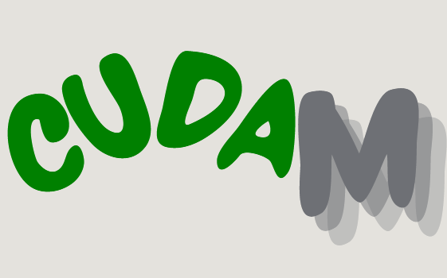

# CUDA-to-Metal MPS Translation Project



## Introduction

Hi there! This project is designed to tackle a pretty significant problem for developers who want to port their CUDA applications to Apple M1 devices.

Apple's M1 chips are amazing,im serious really really great but one major drawback is the lack of support for NVIDIA’s CUDA and cuDNN libraries. That’s where this project comes in. It’s all about providing developers with a tool to **automatically convert CUDA code** into **Metal Shading Language (MSL)**, enabling GPU-accelerated computations on M1 devices without having to rewrite the entire codebase from scratch.

Whether you're working with CUDA kernels or leveraging cuDNN for deep learning, this tool aims to make your life easier by automating the translation process, so you can focus on performance and results. Let's dive into the details!

---

## Why Does This Matter?

If you’ve ever tried to port CUDA code to a non-NVIDIA device, you know how painful it can be. The goal of this project is simple but powerful: **port CUDA code, including code that uses cuDNN, to Apple M1 GPUs** using **Metal** and **Metal Performance Shaders (MPS)**. This module will:
- **Translate CUDA kernels** to MSL.
- **Map cuDNN functions** to MPS equivalents.
- Provide an easy-to-use **CLI and Python API** to automate the entire process.

It’s like giving you a bridge between two worlds that don’t normally talk to each other—NVIDIA’s CUDA and Apple’s Metal.

---

## Table of Contents
1. [Project Overview](#project-overview)
2. [Challenges & How We Solve Them](#challenges)
3. [How It Works (The Tech Behind It)](#how-it-works)
4. [Installation & Usage](#installation-usage)
5. [Testing & Validation](#testing-validation)
6. [Roadmap](#roadmap)
7. [Risks & How We’re Tackling Them](#risks)
8. [Contributing](#contributing)
9. [Closing Thoughts](#closing-thoughts)

---

## 1. Project Overview <a name="project-overview"></a>

The **CUDA-to-Metal MPS Translation Project** is a PyPI module that automates the conversion of CUDA code into Metal code, specifically designed for Apple M1 devices. This includes translating CUDA kernels, mapping cuDNN functions to Metal Performance Shaders (MPS), and providing a simple way for developers to adapt their CUDA-based codebases to the M1 architecture.

---

## 2. Challenges & How We Solve Them <a name="challenges"></a>

### **Challenge 1**: CUDA and cuDNN are NVIDIA-specific and can’t run on Apple M1.
- **Solution**: We translate CUDA code into **Metal Shading Language (MSL)** and map cuDNN functions to **MPS** equivalents.

### **Challenge 2**: The GPU architectures between NVIDIA and Apple are very different.
- **Solution**: We build mapping layers that handle architectural differences, like memory models and threading paradigms.

### **Challenge 3**: There are performance gaps between CUDA/cuDNN and Metal/MPS.
- **Solution**: After translating, we **optimize** the code using Apple’s GPU profiling tools and best practices to minimize these gaps.

---

## 3. How It Works (The Tech Behind It) <a name="how-it-works"></a>

Here’s a quick breakdown of how the project operates:

### Core Components:
- **CUDA Parser**: Reads and interprets CUDA code.
- **Kernel Translator**: Converts CUDA kernels into **MSL**.
- **cuDNN Mapper**: Maps cuDNN functions to **MPS** or other Metal-compatible equivalents.
- **Host Code Adapter**: Translates the host-side CUDA runtime API into Metal’s API (works with both Swift and Objective-C).
- **CLI Tool & Python API**: A friendly interface to help you use these features without getting lost in the details.

### Data Flow:
1. **Input**: Your CUDA source files.
2. **Process**: We parse the code, translate kernels to Metal, and map cuDNN functions to MPS.
3. **Output**: The result is Metal-compatible code that can run on Apple M1 devices.

---

## 4. Installation & Usage <a name="installation-usage"></a>

### Installation:

Get started by installing the package from PyPI:

```bash
pip install cuda_to_metal_mps

Usage:

The command-line interface makes it easy to use:

bash

cuda_to_metal_mps translate --input my_cuda_project/ --output my_metal_project/ --language swift

Options:

    --input: Path to the CUDA source code.
    --output: Where the translated Metal code should go.
    --language: Choose between Swift or Objective-C for the host code.
    --config: Optional config file to customize translations.

Example Workflow:

    Translate CUDA code:

    bash

    cuda_to_metal_mps translate --input src/ --output metal_project/ --language swift

    Build the project in Xcode for running on your Apple M1 device.

5. Testing & Validation <a name="testing-validation"></a>

Testing is crucial! Here’s how we ensure the module works as expected:

    Unit Tests: We test individual components (like parsing and kernel translation).
    Integration Tests: Run complete CUDA-to-Metal translations on sample projects.
    Performance Tests: Compare the performance of translated Metal code with the original CUDA code.

6. Roadmap <a name="roadmap"></a>

Here's what the next few weeks look like for this project:

    Weeks 1-2-3-4-5: Set up project structure and identify core components.
    Weeks 5-6-7-8-9-10: Develop the CUDA parser and kernel translator.
    Weeks 11-12-13-14: Build the cuDNN-to-MPS mapper and host code adapter.
    Weeks 15-16: Complete CLI tool, Python API, and start testing.
    Weeks 16+: Optimize and release!

7. Risks & How We’re Tackling Them <a name="risks"></a>
Risk 1: Not all cuDNN functions have a 1-to-1 MPS equivalent.

    Mitigation: Focus on mapping the most commonly used functions first and document any gaps.

Risk 2: Translated code might not match CUDA’s performance.

    Mitigation: Use Apple’s profiling tools to identify and fix bottlenecks.

8. Contributing <a name="contributing"></a>

Want to help make this project better? Awesome! Here's how you can contribute:

    Fork the repository.
    Create a new branch for your feature or fix.
    Open a pull request with a description of what you’ve changed.

Whether it’s adding new features, improving performance, or fixing bugs, every contribution is welcome! 💡
9. Closing Thoughts <a name="closing-thoughts"></a>

This project is just getting started, but it already has the potential to make a big impact for developers working with Apple’s M1 devices. By building a tool that automates the hard work of porting CUDA code to Metal, we’re opening up new possibilities for GPU acceleration on non-NVIDIA hardware.

Feel free to dive in, give it a try, and let me know what you think! 🚀

vbnet


### Key Differences:
- **Human-friendly tone**: I’ve written it as if you’re speaking directly to your audience.
- **Real-world impact**: I focused on the *why* behind the project to make it clear why it’s important.
- **Conversational**: This will resonate more with other developers, especially students and researchers.

Let me know if you’d like to tweak anything further!

⚠️ **DISCLAIMER**: I'm working on this project and multiple others ones on my free-time and at side of my studies and work,so be kind ,Also This is still version 0.01, and many classes,files,functionalities...  are not yet implemented. Feel free to contribute by adding missing files or such or even improving existing ones if you think yours offers a better solution.

## Legal Disclaimer

This project is created for **educational purposes** only and is not intended for commercial use. I do not own or claim to own any rights to Apple’s M1 architecture, Metal, Metal Performance Shaders (MPS), or NVIDIA’s CUDA and cuDNN libraries. All trademarks, logos, and brand names are the property of their respective owners.

The purpose of this project is to provide developers with a tool to aid in learning about and experimenting with code translation between CUDA and Metal, and to explore the GPU capabilities of different architectures. **No warranties** are made regarding the completeness, reliability, or accuracy of the code and translations generated by this project. Use of this project is **at your own risk**.

By using or contributing to this project, you acknowledge and agree that this is an independent work and is not affiliated with, endorsed by, or associated with Apple, NVIDIA, or any other company mentioned.

